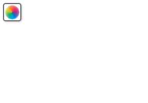
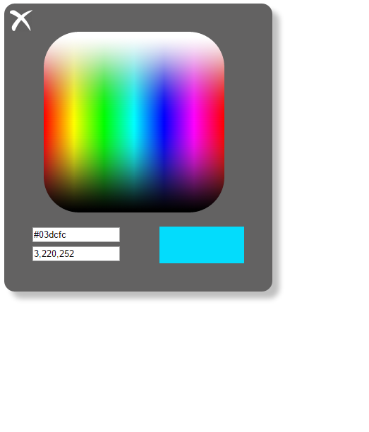

# jQuery Colorpicker

## Задание 2

Создать JQuery плагин, который создает панель выбора цвета в месте размещения переданного элемента

- Изначально панель должна быть скрыта. На ней должна быть кнопка, которая позволяет открывать панель:

- При нажатии на кнопку, панель должна открываться и выглядеть примерно так:

- Должна быть кнопка `close` для скрытия панели.
- Для панели и выбора цвета используйте `canvas` и `canvas` API.
    - _Хак_: Изучите `canvas.drawImage` метод.
    - _Хак_: Изучите `canvas.getImageData` метод.
- Когда происходит клик по области выбора цвета, цвет на который указывает мышь, должен быть выбран:
    - так же должно быть RGB поле ввода.
    - и HEX поле ввода.
    - В `div` элементе нижнего правого угла панели, должен быть цвет фона.
    - _Бонус_: скопировать выбранный цвет при выборе в буфер обмена в HEX формате.

- Когда значение в одном из полей ввода меняется, вы должны изменить значение выбранного цвета и показать в правом нижнем углу этот цвет.
    - _Бонус_: скопировать выбранный цвет при выборе в буфер обмена в HEX формате.

### Замечания
- Не используйте встроенные стили. Используйте JQuery для прикрепления классов и CSS для стилей палитры цветов.
- Прикрепляйте события к родительским элементам.
- Некоторые элементы (такие как изображения) загружаются асинхронно в браузере. используйте их события `onload`
- Используйте семантику html.
- Попробуйте использовать отзывчивый дизайн.
- Ищите ответы в сети интернет.

