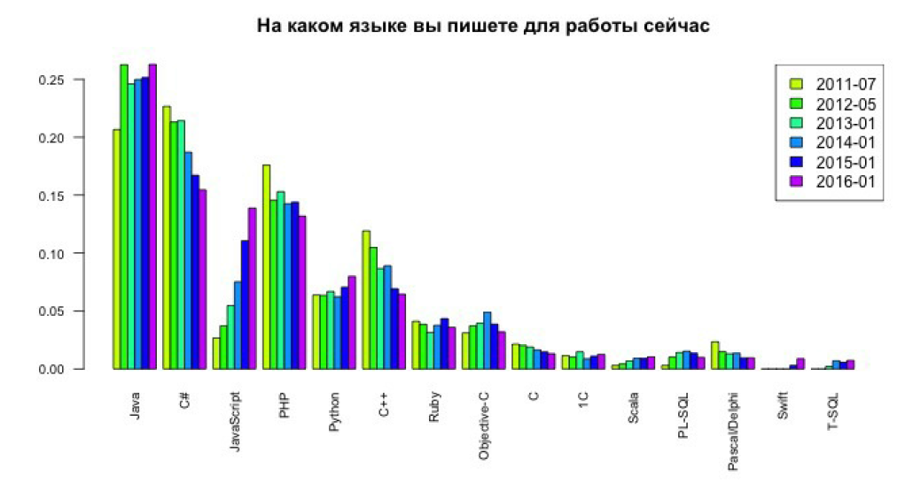
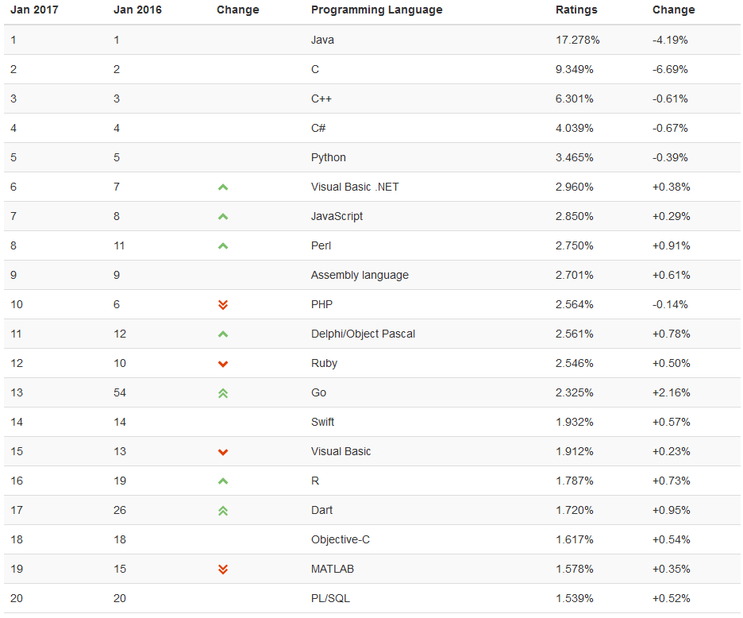
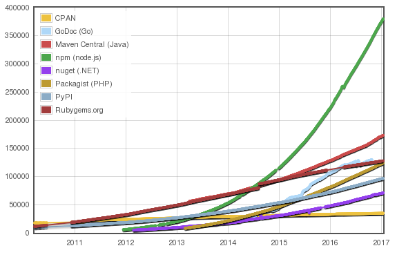

#  JavaScript курс
### 1 Введение в мир JS

**Dynamic HTML или DHTML** — это способ (подход) создания интерактивного веб-сайта, использующий сочетание статичного языка разметки HTML, встраиваемого (и выполняемого на стороне клиента) скриптового языка JavaScript, CSS (каскадных таблиц стилей) и DOM (объектной модели документа).
Он может быть использован для создания приложения в веб-браузере: например для более простой навигации или для придания интерактивности форм. DHTML может быть использован для динамического перетаскивания элементов по экрану. Также он может служить как инструмент для создания основанных на браузере видеоигр.
DHTML приложения, которые вполне автономны в браузере, без серверной поддержки, такой как база данных, иногда вынуждены обращаться к Single Page Applications, или SPA.

#### DHTML = HTML + CSS + JavaScript

- **HTML** - язык разметки, он определяет положение контента на странице, используя различные теги (заголовки, параграфы,листы)
- **CSS** - каскадные таблицы стилей. Определяет правила и стили оформления элементов HTML документа (Шрифты, заливку, позицию, отступы, видимость, переходы)
- **Javascript** - определяет динамическое поведение на странице, позволяет интерактивно реагировать на действия пользователя в документе:
    - Валидация форм
    - Изменение структуры HTML элементов на странице
    - Выполнение сложных вычислений
    - Обмен информацией с удаленным сервером, без перезагрузки страницы
    - Графика
    В настоящее время активно используется не только на стороне клиента но и на нем часто строится серверная часть приложений.

### История возникновения JS


- **В 1992 году** компания Nombas начала разработку встраиваемого скриптового языка Cmm
-  **В конце ноября 1995** года Nombas разработала версию CEnvi, внедряемую в веб-страницы.
- Перед Бренданом Эйхом, нанятым в компанию Netscape **4 апреля 1995** года, была поставлена задача внедрить язык программирования Scheme в браузер Netscape.
-  **4 декабря 1995** года LiveScript переименовали в JavaScript. 28 компаний приняли на вооружение.
- **ECMAScript** - Принятие спецификации состоялось в июне 1997 года. Будучи отправленной в ISO/IEC JTC 1 для принятия по процедуре Fast-Tracking, она послужила основой международного стандарта ISO/IEC 16262
- **Июнь 2015** вышла спецификация ES2015, с этого времени организацией по сертификации принято применять изменения ежегодно.

### Популярность




Согласно TIOBE Index, базирующемуся на данных поисковых систем Google, MSN, Yahoo!, Википедия и YouTube, в апреле 2015 года JavaScript находился на 6 месте (год назад на 9).


На конференции Node.js Interactive озвучены заслуживающие внимания достижения проекта NPM, в рамках которого сформирован крупнейший в мире репозиторий пакетов (если не принимать во внимание, что многие пакеты включают лишь несколько строк кода). В настоящее время в NPM размещено более 380 тысяч пакетов. Для сравнения в репозитории Apache Maven присутствует 173 тысячи пакетов, в Rubygems.org - 127 тысяч, в Packagist (PHP) - 123 тысячи, в PyPI - 96 тысяч, в nuget (.NET) - 70 тысяч, в CPAN - 34 тысячи.
За последние 28 дней через NPM было установлено 18 миллиардов пакетов и загружено 6 миллиардов пакетов (66% установок осуществлено из кэша, поэтому число загрузок меньше, чем число установок). Еженедельно примерно 160 новых разработчиков публикуют в NPM свои первые пакеты. Число зарегистрированных пользователей NPM составляет 314 тысяч, из которых 102 тысячи являются активными разработчиками, публикующими свои пакеты. Примечательно, что несмотря на то, что NPM создавался для серверного использования с Node.js, около 80% пользователей используют NPM в том числе при разработке фронтэндов (клиентские web-приложения), а 20% - только на стороне фронтэнда.

### Возможности языка
- подписка на события и их обработка
- Манипулировние DOM деревом
- Работа с cookies и browser storage
- Обработка исключений
- Сетевой обмен данными

### "Движки" и особенности

Втроен в браузер и зависит от производителя: V8 в Chrome, Chakra в IE, Spidermonkey в Firefox, JavaScriptCore в Safari.

- Является объектно-ориентированным языком, только в последней версии использование подхода для работы с объектами соответствует подходу в других языках
- Имеет ряд свойств присущих функциональным языкам, позволят использовать функции как объекты первого порядка: передавать как аргументы, возвращать и присваивать переменным
- Автоматическое приведение типов
- Автоматическая сборка мусора
- Анонимные функции
- Компилируется в момент исполнения


### Первый скрипт


```html
    <html>
        <body>
          <scriрt type="text/javascript">
            alert('Hello JavaScript!');
          </scriрt>
        </body>
    </html>
```
### Использование JavaScript на HTML странице

Javascript код должен быть заключен в теги:
- в ``<head>`` тег ``<script>``
- в ``<body>`` тег ``<script>``
- Во внешних файлах и импортиорован в документ посредством указания источника

```html
<scriрt src="scripts.js" type="text/javascript">
<!-- Код размещенный здесь не вызовется -->
</scriрt>
```

### В каких случаях вызывается?

- Выполянется во время загрузки страницы или когда браузер запускает событие
    - Все инструкции выполняются во время загрузки страницы
    - Некоторые операторы определяют функции которые могут быть вызваны позже
- Может быть добавлен как обработчик событий через атрибут тегов непосредственно к HTML элементу
    - выполняется когда событие вызывается браузером
    ```html
    
    ```
### Пример выполнения после возникновения события

```html
    <html>
        <head>
            <scriрt type="text/javascript">
              function test (message) {
                alert(message);
              }
            </scriрt>
        </head>

        <body>
          
        </body>
    </html>
```

### Использование внешних файлов

- HTML страница

```js
<html>
    <head>
      <scriрt src="sample.js" type="text/javascript">
      </scriрt>
    </head>
    <body>
      <button onclick="sample()" value="Call JavaScript function from sample.js"/>
    </body>
</html>
```
- Внешний файл

```js
function sample() {
  alert('Hello from sample.js!')
}
```

### JavaScript синтаксис

Очень похож на синтаксис C#
- Операторы (+, *, = , !=, &&, ++, ...)
- Переменные (не типизируются)
- Условия (if, else)
- Циклы (for, while)
- Массивы (array[] и ассоциативные массивы array['abc'])
- Функции (могут возвращать значения)

### Стандартные всплывающие диалоговые блоки
- Блок ``alert`` имеет кнопку ``[OK]`` - просто показывает уведомление <br>

 ```js
 alert("Какой то текст");
 ```

- Блок подтверждения ``confirm`` - имееет кнопки ``[OK]`` и ``[Cancel]`` <br>

```js
confirm("Вы уверены?");
```

- Блок ввода - содержит текст поле ввода и значение по умолчанию <br>

```js
prompt("введите значение", 10);
```

### Встроенные обьекты браузера

Через эти обьекты Javascript получает доступ к браузеру и содержимому веб страницы
- **window** - Верхний уровень DOM дерева, представляет окно браузера
- **document** - содержит информацию о текущем загруженном на странице документе
- **screen** - Хранит параметры дисплея
- **browser** - Содержит информацию о браузере

### Объект Math
Объект Math позволяет работать с математическими функциями

```js
for (i = 1; i <= 5; i++) {
  var x = Math.random();
  x = 10 * x + 1;
  x = Math.floor(x);
  console.log(
      "Random number (" +
      i + ") in range " +
      "1..10 --> " + x);
}
```

### Объект Date
Объект Date() позволяет работать с календарными функциями

```js
var now = Date();
var result = "сейчас " + now
```
### Задержка выполнения

```js
function bang() {
    console.log("Прошло 5 секунд")
}

var timer = setTimeout(bang, 5000);

```
#####  ```clearTimeout(timer);``` - останавливает таймер и предотвращает вызов функции

### Повтор выполнения через определенные промежутки времени

```js
z = 0
function bang() {
    z++
    console.log("Прошла " + z + " секунда")
}

function clear() {
    clearInterval(timer);
    z = 0;
}

var timer = setInterval(bang, 1000);
// через 5 секунд останавливаем функцию
var stop = setTimeout(clear, 5060);
```
### Пример таймера

```js
<scriрt type="text/javascript">
  function timerFunc() {
    var now = new Date();
    var hour = now.getHours();
    var min = now.getMinutes();
    var sec = now.getSeconds();
    document.getElementById("clock").value =
      "" + hour + ":" + min + ":" + sec;
  }
  setInterval(timerFunc, 1000);
</scriрt>
<input type="text" id="clock" />
```

### Дебажинг
- Современные браузеры имеют консоль, в которую вываливается служебная информация и сыпятся ошибки от исполняемых скриптов, ошибки могут отличаться в различных браузерах.
- Некоторые системы предоставляют возможность детального отслеживания ошибок, установку контрольных точек и наблюдателей
- существует отличное приложение Firebug для Firefox
- Node.js позволяет скидывать в лог информацию
- Вывод информации в консоль, в зависимости от типа сообщение может быть отформатировано стилистически или скрипт приостановить свое выполнение.

    - **debug("Сообщение или переменная")**
    - **info("Сообщение или переменная")**
    - **log("Сообщение или переменная")**
    - **warn("Сообщение или переменная")**
    - **error("Сообщение или переменная")**
